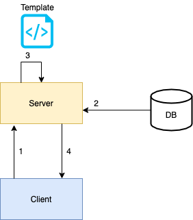
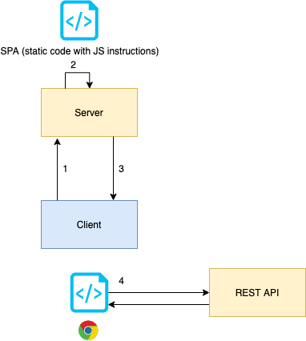

## What is the project about?
This project aims to demonstrate the difference between a server side rendered page (using JSP) and a SPA (composed of a front end and a REST API as the backend)

### The functionality
The project is a webpage that displays Chuck Norris facts, because everyone knows that `Chuck Norris threw a grenade and killed 50 people, then it exploded.`, so you should worship him.
In order to display those facts, the application is divided in 2 main parts
   1. Retrieve Facts from the official [Chuck Norris Fact API](https://api.chucknorris.io/).
   This happens in a scheduled way, and it will fetch some facts on each round. Those facts will then be stored in a Database
   2. After that, the facts will be displayed on the front-end.
   
This division is no coincidence, it will serve its purpose later on when we try to deploy it, as it will demonstrate how to deploy an application in a cloud environment

## Dynamic approach
- Code can be found in `/dynamic`
- Uses JSP (JavaServer Pages)
- The content is a Spring Boot Java application.
- Contains the static files that will be served inside of the Spring boot server boundary

### Flow



    1. Client requests a page
    2. Server fetches data from DB
    3. Server reads a template and puts the data previously fetched 
    4. The HTML file is sent back to the client with all the fields populated

## SPA approach
- Code can be found in `/spa`
- Uses a REST API (Spring boot app) and an Angular application that consumes it
- The Spring boot application will contain the logic to retrieve facts, store them and present them in a JSON whenever a client requests for them
- The Angular application will be fetching a fact on page load (also whenever the image is clicked)

This allows a total separation between the data and the way we present it. If we want to create many other ways to display the data, we can do so without having to touch the server side code

### Flow



    1. Client requests a page
    2. Server X returns static bundle from the SPA framework.
    3. The static bundle is sent back to the client (only 1 HTML page)
    4. The client now uses JS to update the view (internally it will feel like many pages are implemented) and will call a third party (REST API) on server Y

----------------------------------------------------------

### Configuration
#### The backend (for both SPA and Dynamic)
The project can be configured by providing the following properties:
```properties
chuck-api.n-jokes: 10
chuck-api.fetch-rate-ms: 5000
```
It also contains an embedded database (H2) for the `dev` profile. This will only be useful for local development or for the first steps

If a real database (relational) should be used, then the `prod` Maven profile should be used, in that case we should provide the following ENV variables in the machine that runs our code
```
DB_HOST
DB_PORT
DB_SCHEMA
DB_USERNAME
DB_PASSWORD
``` 
OR alternatively we can provide the values in the `application-prod.properties` file (use the values instead of the placeholders)
```properties
spring.datasource.url=jdbc:mysql://<DB_HOST>:<DB_PORT>/<DB_SCHEMA>
spring.datasource.username=<DB_USERNAME>
spring.datasource.password=<DB_PASSWORD>
```

#### The frontend (for the SPA case)
Additionally we should provide a value for the environment `restApiUrl` within the angular project in the file `spa/chucknorris-spa/src/environments/evironment.prod.ts`

----------------------------------------------------------
### Running the application


#### Spring boot application

Configure the properties, define a profile if you want to use an external DB and do the following:

1. Package the application `mvn clean package` 
    - If we want a real database and use the Maven `prod` profile then add `-Pprod` to the command above. 
      - `mvn clean package -Pprod`

2. Run the JAR `java -jar target/rest-api-0.0.1-SNAPSHOT.jar`
    - If we want a real database, remember to fill in the environment variables and enable the Spring boot profile `prod` by also setting the env var `SPRING_PROFILES_ACTIVE=prod`
      - `SPRING_PROFILES_ACTIVE=prod java -jar target/rest-api-0.0.1-SNAPSHOT.jar`

OR

1. Alternatively run `mvn spring-boot:run` 
    - If the real database is required, set all the env variables in the command and enable the maven profile `prod`
      - `DB_HOST=<whatever> DB_PORT=<whatever> DB_SCHEMA=<whatever> DB_USERNAME=<whatever> DB_PASSWORD=<whatever> SPRING_PROFILES_ACTIVE=prod mvn spring-boot:run -Pprod`


#### Angular app

1. Have Angular installed in your machine (you need nodeJS/npm and then install Angular globally)   
    1.1 [Download NodeJS/npm](https://nodejs.org/en/download/)  
    1.2 Install angular globally `npm install -g @angular/cli`
2. Install dependencies for the project `npm install` (you must run this command at the same directory level as package.json)
3. Deployment
    - Local environment  
        - Modify `environment.ts` and update the url for the REST API if it has changed  
        - Run `ng serve`    
    - "Production" like environment  
        - Modify `environment.prod.ts` and update the url for the REST API if it has changed
        - Run `ng build --prod`
        - From the `dist/chucknorris-spa` directory that will be created, get the files and put them behind a web server
    

----------------------------------------------------------

